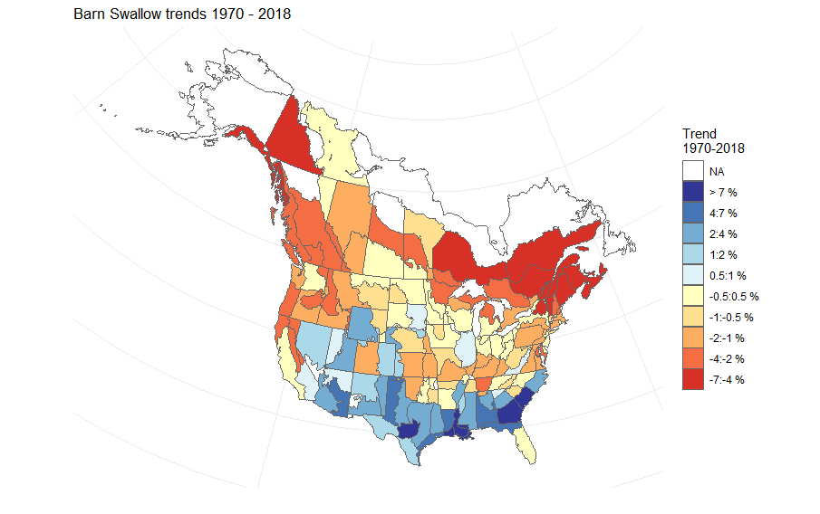

# bbsBayes 

[](https://cran.r-project.org/package=bbsBayes)

This README file provides an overview of the functionality that can be
accomplished with 'bbsBayes'. It is intended to provide enough information for
users to perform, at the very least, replications of status and trend estimates
from the Canadian Wildlife Service and/or United States Geological Survey.
However, it provides more in-depth and advanced examples for subsetting data,
custom regional summaries, and more.

Additional resources:
* [Introductory bbsBayes Workshop](https://github.com/AdamCSmithCWS/bbsBayes_Intro_Workshop)
* [Journal Article with worked example](https://doi.org/10.5334/jors.329)

## Overview

bbsBayes is a package to perform hierarchical Bayesian analysis of North
American Breeding Bird Survey (BBS) data. 'bbsBayes' will run a full model
analysis for one or more species that you choose, or you can take more control
and specify how the data should be stratified, prepared for Stan, or modelled.

 

## Installation

Option 1: Stable release from CRAN

```{r, eval = FALSE}
# To install from CRAN:
install.packages("bbsBayes")
```

Option 2: Less-stable development version

``` {r, eval = FALSE}
# To install the development version from GitHub:
install.packages("devtools")
library(devtools)
devtools::install_github("BrandonEdwards/bbsBayes")
```

