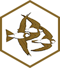
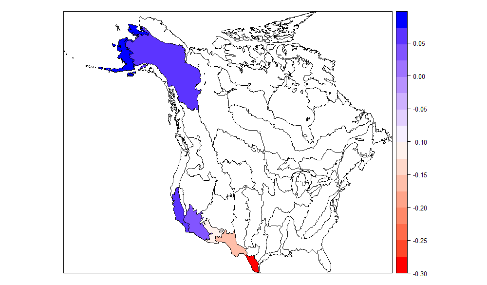

# bbsBayes 

[](https://travis-ci.org/BrandonEdwards/bbsBayes)
[](https://cran.r-project.org/package=bbsBayes)

## Foreward
bbsBayes is currently undergoing beta testing. Thus, we expect features and analyses may not work as intended until a stable version 1.0.0 is released. 

Users of this package shoud heed caution in using the beta version for any Breeding Bird Survey analyses. We plan to have a stable version 1.0.0 released to CRAN in early April 2019.

## Overview
bbsBayes is a package to perform hierarchical Bayesian analysis of North American Breeding Bird Survey (BBS) data. 'bbsBayes' will run a full model analysis for one or more species that you choose, or you can take more control and specify how the data should be stratified, prepared for JAGS, or modelled. 

## Installation

The updated beta version of v1.0.0 is now out!
``` r
# To install v1.0.0-beta.3 from Github:
install.packages("devtools")
library(devtools)
devtools::install_github("BrandonEdwards/bbsBayes", ref = "v1.0.0-beta.3")
```

Alternatively, you could install the less-stable development version.
``` r
# To install the development version from GitHub:
install.packages("devtools")
library(devtools)
devtools::install_github("BrandonEdwards/bbsBayes")
```

## Usage

bbsBayes provides functions for every stage of Breeding Bird Survey data analysis.

### Data Retrieval 
You can download BBS data by running `fetch_bbs_data` and saving it to a variable. You must agree to the terms and conditions of the data usage before downloading.

``` r
bbs_data <- fetch_bbs_data()
```

Alternatively, use the sample data provided with the package, which provides full species data for Pine Grosbeak, Wood Thrush, and King Rail.

```r
bbs_sample <- fetch_sample_data()
```

### Data Preparation
#### Stratification
Stratification plays an important role in trend analysis. Use the `stratify()` function on the `bbs_data` you downloaded, and specify how you would like to stratify your data by. Set `stratify_by` by choosing one of the following:
* bbs_cws -- Political region X Bird Conservation region intersection (CWS method)
* bbs_usgs -- Political region X Bird Conservation region intersection (USGS method)
* bcr -- Bird Conservation Region only
* state -- Political Region only
* latlong -- Degree blocks (1 degree of latitude X 1 degree of longitude)

``` r
strat_data <- stratify(bbs_data, stratify_by = "state")
```

#### Jags Data
JAGS models require the data to be sent as a data frame depending on how the model is set up. `prepare_jags_data` subsets the stratified data based on species and wrangles relevent data to use for JAGS models.

``` r
jags_data <- prepare_jags_data(strat_data, 
                               species_to_run = "Pine Grosbeak", 
                               model = "slope")
```

### MCMC
Once the data has been prepared for JAGS, the model can be run. The following will run MCMC with default number of iterations. Note that this step usually takes a long time.

``` r
mod <- run_model(jags_data = jags_data)
```

Alternatively, you can set how many iterations, burn-in steps, or adapt steps to use
``` r
mod <- run_model(jags_data = jags_data,
                 n_burnin = 1000,
                 n_iter=1000,
                 n_adapt = 500)
```

### Model Analysis
There are a number of tools available to analyse the posterior chain output from the MCMC model. The main metric is annual trend, which can be calculated for each stratum:
``` r
strat_indices <- generate_strata_indices(mod)
strat_trend <- generate_strata_trends(indices = strat_indices)
```

These trends can be plotted on a map
``` r
generate_map(strat_trend, stratify_by = "state")
```

Which produces



There are numerous other functions available for analysis of the data.


## Lifecycle
[](https://www.tidyverse.org/lifecycle/#experimental)

bbsBayes is currently going through multiple internal code
reviews, tests, and API updates. Most likely, the API you use
today will be slightly different than the one you use tomorrow.

The near-future goal is to publish a maturing version on CRAN.
Be sure to check back for updates!
