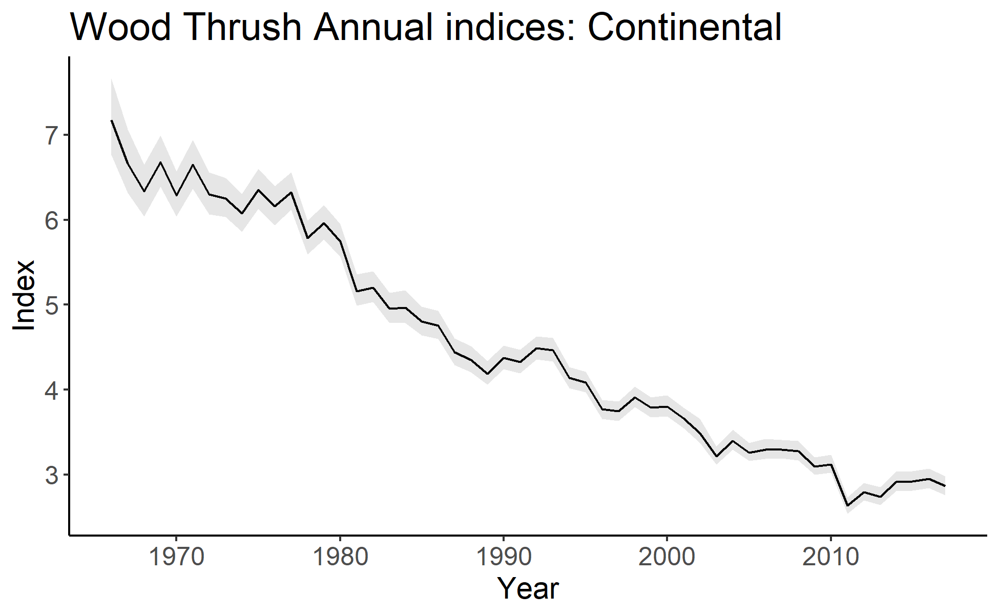

# bbsBayes 

[](https://travis-ci.org/BrandonEdwards/bbsBayes)
[](https://cran.r-project.org/package=bbsBayes)
[](https://www.tidyverse.org/lifecycle/#maturing)

## Overview
bbsBayes is a package to perform hierarchical Bayesian analysis of North American Breeding Bird Survey (BBS) data. 'bbsBayes' will run a full model analysis for one or more species that you choose, or you can take more control and specify how the data should be stratified, prepared for JAGS, or modelled. 

## Installation

We expect a CRAN release shortly, but for now you can install from Github using the following options:

Option 1: Most recent stable release (currently v2.0.0)
``` r
# To install v2.0.0 from Github:
install.packages("devtools")
library(devtools)
devtools::install_github("BrandonEdwards/bbsBayes", ref = "v2.0.0")
```

Option 2: Less-stable development version
``` r
# To install the development version from GitHub:
install.packages("devtools")
library(devtools)
devtools::install_github("BrandonEdwards/bbsBayes")
```

## Usage

bbsBayes provides functions for every stage of Breeding Bird Survey data analysis.

### Data Retrieval 
You can download BBS data by running `fetch_bbs_data`. This will save it to a
package-specific directory on your computer. You must agree to the terms and conditions of the data usage before downloading.

``` r
fetch_bbs_data()
```

### Data Preparation
#### Stratification
Stratification plays an important role in trend analysis. Use the `stratify()` function for this job. Set the argument `by` to stratify by the following options:
* bbs_cws -- Political region X Bird Conservation region intersection (CWS method)
* bbs_usgs -- Political region X Bird Conservation region intersection (USGS method)
* bcr -- Bird Conservation Region only
* state -- Political Region only
* latlong -- Degree blocks (1 degree of latitude X 1 degree of longitude)

``` r
strat_data <- stratify(by = "bbs_cws")
```

#### Jags Data
JAGS models require the data to be sent as a data frame depending on how the model is set up. `prepare_jags_data` subsets the stratified data based on species and wrangles relevent data to use for JAGS models.

``` r
jags_data <- prepare_jags_data(strat_data, 
                               species_to_run = "Wood Thrush", 
                               model = "slope")
```

### MCMC
Once the data has been prepared for JAGS, the model can be run. The following will run MCMC with default number of iterations. Note that this step usually takes a long time.

``` r
mod <- run_model(jags_data = jags_data)
```

Alternatively, you can set how many iterations, burn-in steps, or adapt steps to use
``` r
mod <- run_model(jags_data = jags_data,
                 n_burnin = 1000,
                 n_iter=1000,
                 n_adapt = 500)
```

### Model Analysis
There are a number of tools available to analyse the posterior chain output from the MCMC model. The main metric is annual trend, which can be calculated for each stratum:
``` r
strat_indices <- generate_strata_indices(mod)
strat_trend <- generate_strata_trends(indices = strat_indices)
```

These trends can be plotted on a map
``` r
generate_map(strat_trend, stratify_by = "bbs_cws")
```

Which produces


You can also generate continent-wide indices:
```r
cont_indices <- generate_cont_indices(mod)
```

Which can then be plotted using
```
plot_cont_indices(indices = cont_indices)
```

Which produces



There are numerous other functions available for analysis of the data.
