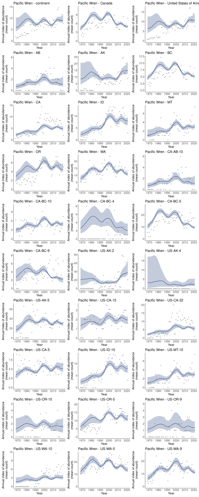
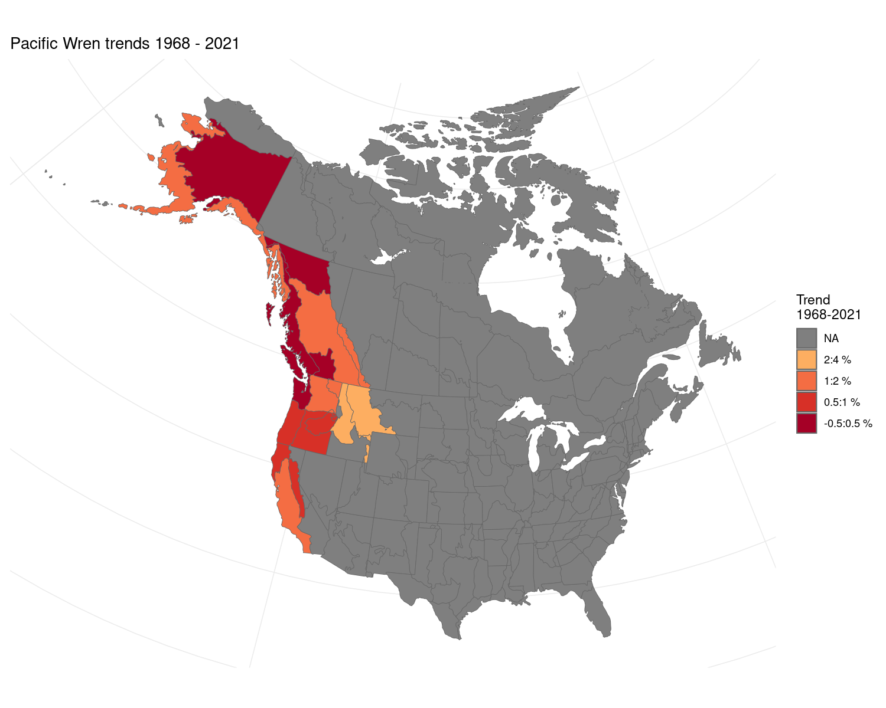

## Data prep

### Load packages

```r
library(bbsBayes)
library(patchwork)
library(ggplot2)
```

### Stratify

```r
s <- stratify(by = "bbs_cws", sample = TRUE)
#> Using 'bbs_cws' (standard) stratification
#> Using sample BBS data...
#> Using species Pacific Wren (sample data)
#> Stratifying data...
#>   Combining BCR 7 and NS and PEI...
#>   Renaming routes...
```

### Prepare counts

```r
p <- prepare_data(s, min_max_route_years = 2)
```

### Prepare spatial

```r
map <- load_map("bbs_cws")
ggplot(map, aes(fill = strata_name)) +
  geom_sf(show.legend = FALSE)
```


```r

n <- prepare_spatial(p, map)
#> Preparing spatial data...
#> Identifying neighbours (non-Voronoi method)...
#> Formating neighbourhood matrices...
#> Plotting neighbourhood matrices...
```

### Prepare model

```r
md <- prepare_model(n, model = "gam", model_variant = "spatial")
```

## Run model

```r
m <- run_model(md, iter_sampling = 10, iter_warmup = 10, chains = 2)
#> One set of `init` values supplied, duplicating for each chain.
#> Compiling Stan program...
#> 
-

\

|

/

-

\

|

/

-

\

|

/

-

\

|

/

-

\

|

/

-

\

|

/

-

\

|

/

-

\

|

/

-

\

|

/

-

\

|

/

-

\

|

/

-

\

|

/

-

\

|

/

-

\

|

/

-

\

|

/

-

\

|

/

-

\

|

/

-

\

|

/

-

\

|

/

-

\

|

/

-

\

|

/

-

\

|

/

-

\

|

/

-

\

|

/

-

\

|

/

-

\

|

/

-

\

 
Running MCMC with 2 chains, at most 4 in parallel...
#> 
#> Chain 1 WARNING: No variance estimation is 
#> Chain 1          performed for num_warmup < 20 
#> Chain 1 Iteration:  1 / 20 [  5%]  (Warmup)
#> Chain 1 Informational Message: The current Metropolis proposal is about to be rejected because of the following issue:
#> Chain 1 Exception: neg_binomial_2_log_lpmf: Precision parameter is 0, but must be positive finite! (in '/tmp/RtmpATuXX9/model-fc1b19b1b7fb.stan', line 230, column 3 to column 40)
#> Chain 1 If this warning occurs sporadically, such as for highly constrained variable types like covariance matrices, then the sampler is fine,
#> Chain 1 but if this warning occurs often then your model may be either severely ill-conditioned or misspecified.
#> Chain 1
#> Chain 1 Informational Message: The current Metropolis proposal is about to be rejected because of the following issue:
#> Chain 1 Exception: neg_binomial_2_log_lpmf: Precision parameter is 0, but must be positive finite! (in '/tmp/RtmpATuXX9/model-fc1b19b1b7fb.stan', line 230, column 3 to column 40)
#> Chain 1 If this warning occurs sporadically, such as for highly constrained variable types like covariance matrices, then the sampler is fine,
#> Chain 1 but if this warning occurs often then your model may be either severely ill-conditioned or misspecified.
#> Chain 1
#> Chain 1 Informational Message: The current Metropolis proposal is about to be rejected because of the following issue:
#> Chain 1 Exception: neg_binomial_2_log_lpmf: Precision parameter is 0, but must be positive finite! (in '/tmp/RtmpATuXX9/model-fc1b19b1b7fb.stan', line 230, column 3 to column 40)
#> Chain 1 If this warning occurs sporadically, such as for highly constrained variable types like covariance matrices, then the sampler is fine,
#> Chain 1 but if this warning occurs often then your model may be either severely ill-conditioned or misspecified.
#> Chain 1
#> Chain 1 Informational Message: The current Metropolis proposal is about to be rejected because of the following issue:
#> Chain 1 Exception: neg_binomial_2_log_lpmf: Log location parameter[1] is -nan, but must be finite! (in '/tmp/RtmpATuXX9/model-fc1b19b1b7fb.stan', line 230, column 3 to column 40)
#> Chain 1 If this warning occurs sporadically, such as for highly constrained variable types like covariance matrices, then the sampler is fine,
#> Chain 1 but if this warning occurs often then your model may be either severely ill-conditioned or misspecified.
#> Chain 1
#> Chain 1 Informational Message: The current Metropolis proposal is about to be rejected because of the following issue:
#> Chain 1 Exception: neg_binomial_2_log_lpmf: Precision parameter is 0, but must be positive finite! (in '/tmp/RtmpATuXX9/model-fc1b19b1b7fb.stan', line 230, column 3 to column 40)
#> Chain 1 If this warning occurs sporadically, such as for highly constrained variable types like covariance matrices, then the sampler is fine,
#> Chain 1 but if this warning occurs often then your model may be either severely ill-conditioned or misspecified.
#> Chain 1
#> Chain 2 WARNING: No variance estimation is 
#> Chain 2          performed for num_warmup < 20 
#> Chain 2 Iteration:  1 / 20 [  5%]  (Warmup)
#> Chain 2 Informational Message: The current Metropolis proposal is about to be rejected because of the following issue:
#> Chain 2 Exception: neg_binomial_2_log_lpmf: Precision parameter is 0, but must be positive finite! (in '/tmp/RtmpATuXX9/model-fc1b19b1b7fb.stan', line 230, column 3 to column 40)
#> Chain 2 If this warning occurs sporadically, such as for highly constrained variable types like covariance matrices, then the sampler is fine,
#> Chain 2 but if this warning occurs often then your model may be either severely ill-conditioned or misspecified.
#> Chain 2
#> Chain 2 Informational Message: The current Metropolis proposal is about to be rejected because of the following issue:
#> Chain 2 Exception: neg_binomial_2_log_lpmf: Precision parameter is 0, but must be positive finite! (in '/tmp/RtmpATuXX9/model-fc1b19b1b7fb.stan', line 230, column 3 to column 40)
#> Chain 2 If this warning occurs sporadically, such as for highly constrained variable types like covariance matrices, then the sampler is fine,
#> Chain 2 but if this warning occurs often then your model may be either severely ill-conditioned or misspecified.
#> Chain 2
#> Chain 2 Informational Message: The current Metropolis proposal is about to be rejected because of the following issue:
#> Chain 2 Exception: neg_binomial_2_log_lpmf: Precision parameter is 0, but must be positive finite! (in '/tmp/RtmpATuXX9/model-fc1b19b1b7fb.stan', line 230, column 3 to column 40)
#> Chain 2 If this warning occurs sporadically, such as for highly constrained variable types like covariance matrices, then the sampler is fine,
#> Chain 2 but if this warning occurs often then your model may be either severely ill-conditioned or misspecified.
#> Chain 2
#> Chain 2 Informational Message: The current Metropolis proposal is about to be rejected because of the following issue:
#> Chain 2 Exception: neg_binomial_2_log_lpmf: Log location parameter[1] is -nan, but must be finite! (in '/tmp/RtmpATuXX9/model-fc1b19b1b7fb.stan', line 230, column 3 to column 40)
#> Chain 2 If this warning occurs sporadically, such as for highly constrained variable types like covariance matrices, then the sampler is fine,
#> Chain 2 but if this warning occurs often then your model may be either severely ill-conditioned or misspecified.
#> Chain 2
#> Chain 2 Informational Message: The current Metropolis proposal is about to be rejected because of the following issue:
#> Chain 2 Exception: neg_binomial_2_log_lpmf: Precision parameter is 0, but must be positive finite! (in '/tmp/RtmpATuXX9/model-fc1b19b1b7fb.stan', line 230, column 3 to column 40)
#> Chain 2 If this warning occurs sporadically, such as for highly constrained variable types like covariance matrices, then the sampler is fine,
#> Chain 2 but if this warning occurs often then your model may be either severely ill-conditioned or misspecified.
#> Chain 2
#> Chain 2 Iteration: 11 / 20 [ 55%]  (Sampling) 
#> Chain 1 Iteration: 11 / 20 [ 55%]  (Sampling) 
#> Chain 2 Iteration: 20 / 20 [100%]  (Sampling) 
#> Chain 2 finished in 13.3 seconds.
#> Chain 1 Iteration: 20 / 20 [100%]  (Sampling) 
#> Chain 1 finished in 14.5 seconds.
#> 
#> Both chains finished successfully.
#> Mean chain execution time: 13.9 seconds.
#> Total execution time: 14.6 seconds.
#> Warning: 1 of 20 (5.0%) transitions ended with a divergence.
#> See https://mc-stan.org/misc/warnings for details.
#> Warning: 1 of 2 chains had an E-BFMI less than 0.2.
#> See https://mc-stan.org/misc/warnings for details.
#> Saving model output to /home/steffi/Projects/Business/ECCC/bbsBayes/vignettes/articles/BBS_STAN_gam_spatial_2023-01-06_01.rds
```


## Explore results

### Convergence


```r
conv <- get_convergence(m)
conv
#> # A tibble: 8,803 × 5
#>    variable_type variable       rhat ess_bulk ess_tail
#>    <chr>         <chr>         <dbl>    <dbl>    <dbl>
#>  1 lp__          lp__           2.19       10       10
#>  2 strata_raw    strata_raw[1]  1.52       10       10
#>  3 strata_raw    strata_raw[2]  1.00       10       10
#>  4 strata_raw    strata_raw[3]  1.06       10       10
#>  5 strata_raw    strata_raw[4]  1.09       10       10
#>  6 strata_raw    strata_raw[5]  1.12       10       10
#>  7 strata_raw    strata_raw[6]  1.22       10       10
#>  8 strata_raw    strata_raw[7]  1.37       10       10
#>  9 strata_raw    strata_raw[8]  1.34       10       10
#> 10 strata_raw    strata_raw[9]  1.17       10       10
#> # … with 8,793 more rows
```

### Indices

```r
i <- generate_indices(model_output = m,
                      regions = c("continent",
                                  "country",
                                  "prov_state",
                                  "stratum"))
#> Processing region continent
#> Processing region country
#> Processing region prov_state
#> Processing region stratum

p <- plot_indices(i, add_observed_means = TRUE)
```


```r
patchwork::wrap_plots(p, ncol = 3)
```



### Trends

```r
t <- generate_trends(indices = i)
plot_map(trends = t)
```




### Geofacet plots

```r
plot_geofacet(indices = i, trends = t)
```


## Reproducibility and Clean up

```r
list.files(pattern = "csv|rds")
#> [1] "BBS_STAN_gam_spatial_2023-01-06_01.rds" "BBS_STAN_gam_spatial_2023-01-06-1.csv" 
#> [3] "BBS_STAN_gam_spatial_2023-01-06-2.csv"
unlink(list.files(pattern = "csv|rds"))
```


```r
devtools::session_info()
#> ─ Session info ───────────────────────────────────────────────────────────────────────────────────────────────────
#>  setting  value
#>  version  R version 4.2.1 (2022-06-23)
#>  os       Ubuntu 22.04.1 LTS
#>  system   x86_64, linux-gnu
#>  ui       RStudio
#>  language en_CA:en
#>  collate  en_CA.UTF-8
#>  ctype    en_CA.UTF-8
#>  tz       America/Winnipeg
#>  date     2023-01-06
#>  rstudio  2022.12.0+353 Elsbeth Geranium (desktop)
#>  pandoc   NA
#> 
#> ─ Packages ───────────────────────────────────────────────────────────────────────────────────────────────────────
#>  package        * version date (UTC) lib source
#>  abind            1.4-5   2016-07-21 [1] CRAN (R 4.2.0)
#>  assertthat       0.2.1   2019-03-21 [1] CRAN (R 4.2.0)
#>  backports        1.4.1   2021-12-13 [1] CRAN (R 4.2.0)
#>  bbsBayes       * 3.0.0   2023-01-06 [1] local
#>  bit              4.0.4   2020-08-04 [1] CRAN (R 4.2.0)
#>  bit64            4.0.5   2020-08-30 [1] CRAN (R 4.2.0)
#>  boot             1.3-28  2021-05-03 [4] CRAN (R 4.1.1)
#>  cachem           1.0.6   2021-08-19 [1] CRAN (R 4.2.0)
#>  callr            3.7.3   2022-11-02 [1] CRAN (R 4.2.1)
#>  checkmate        2.1.0   2022-04-21 [1] CRAN (R 4.2.0)
#>  class            7.3-20  2022-01-13 [4] CRAN (R 4.1.2)
#>  classInt         0.4-3   2020-04-07 [1] CRAN (R 4.2.0)
#>  cli              3.4.1   2022-09-23 [1] CRAN (R 4.2.1)
#>  clisymbols       1.2.0   2017-05-21 [1] CRAN (R 4.2.1)
#>  cmdstanr         0.5.3   2022-08-05 [1] Custom
#>  colorspace       2.0-3   2022-02-21 [1] CRAN (R 4.2.0)
#>  covr             3.5.1   2020-09-16 [1] CRAN (R 4.2.0)
#>  crayon           1.5.2   2022-09-29 [1] CRAN (R 4.2.1)
#>  curl             4.3.3   2022-10-06 [1] CRAN (R 4.2.1)
#>  cyclocomp        1.1.0   2016-09-10 [1] CRAN (R 4.2.1)
#>  data.table       1.14.2  2021-09-27 [1] CRAN (R 4.2.0)
#>  DBI              1.1.2   2021-12-20 [1] CRAN (R 4.2.0)
#>  deldir           1.0-6   2021-10-23 [1] CRAN (R 4.2.1)
#>  desc             1.4.2   2022-09-08 [1] CRAN (R 4.2.1)
#>  devtools         2.4.5   2022-10-11 [1] CRAN (R 4.2.1)
#>  digest           0.6.30  2022-10-18 [1] CRAN (R 4.2.1)
#>  distributional   0.3.0   2022-01-05 [1] CRAN (R 4.2.0)
#>  dplyr            1.0.9   2022-04-28 [1] CRAN (R 4.2.0)
#>  e1071            1.7-9   2021-09-16 [1] CRAN (R 4.2.0)
#>  ellipsis         0.3.2   2021-04-29 [1] CRAN (R 4.2.0)
#>  evaluate         0.16    2022-08-09 [1] CRAN (R 4.2.1)
#>  fansi            1.0.3   2022-03-24 [1] CRAN (R 4.2.0)
#>  farver           2.1.1   2022-07-06 [1] CRAN (R 4.2.1)
#>  fastmap          1.1.0   2021-01-25 [1] CRAN (R 4.2.0)
#>  fs               1.5.2   2021-12-08 [1] CRAN (R 4.2.0)
#>  generics         0.1.3   2022-07-05 [1] CRAN (R 4.2.1)
#>  geofacet         0.2.0   2020-05-26 [1] CRAN (R 4.2.1)
#>  geogrid          0.1.1   2018-12-11 [1] CRAN (R 4.2.0)
#>  ggplot2        * 3.4.0   2022-11-04 [1] CRAN (R 4.2.1)
#>  ggrepel          0.9.1   2021-01-15 [1] CRAN (R 4.2.0)
#>  glue             1.6.2   2022-02-24 [1] CRAN (R 4.2.0)
#>  goodpractice     1.0.4   2022-08-30 [1] CRAN (R 4.2.1)
#>  gridExtra        2.3     2017-09-09 [1] CRAN (R 4.2.0)
#>  gtable           0.3.0   2019-03-25 [1] CRAN (R 4.2.0)
#>  highr            0.9     2021-04-16 [1] CRAN (R 4.2.0)
#>  hms              1.1.1   2021-09-26 [1] CRAN (R 4.2.0)
#>  htmltools        0.5.3   2022-07-18 [1] CRAN (R 4.2.1)
#>  htmlwidgets      1.5.4   2021-09-08 [1] CRAN (R 4.2.0)
#>  httpuv           1.6.5   2022-01-05 [1] CRAN (R 4.2.0)
#>  httr             1.4.3   2022-05-04 [1] CRAN (R 4.2.0)
#>  imguR            1.0.3   2016-03-29 [1] CRAN (R 4.2.0)
#>  jpeg             0.1-9   2021-07-24 [1] CRAN (R 4.2.0)
#>  jsonlite         1.8.0   2022-02-22 [1] CRAN (R 4.2.0)
#>  KernSmooth       2.23-20 2021-05-03 [4] CRAN (R 4.0.5)
#>  knitr          * 1.40    2022-08-24 [1] CRAN (R 4.2.1)
#>  labeling         0.4.2   2020-10-20 [1] CRAN (R 4.2.0)
#>  later            1.3.0   2021-08-18 [1] CRAN (R 4.2.0)
#>  lattice          0.20-45 2021-09-22 [4] CRAN (R 4.2.0)
#>  lazyeval         0.2.2   2019-03-15 [1] CRAN (R 4.2.0)
#>  lifecycle        1.0.3   2022-10-07 [1] CRAN (R 4.2.1)
#>  lintr            3.0.0   2022-06-13 [1] CRAN (R 4.2.1)
#>  magrittr         2.0.3   2022-03-30 [1] CRAN (R 4.2.0)
#>  Matrix           1.4-1   2022-03-23 [4] CRAN (R 4.1.3)
#>  matrixStats      0.62.0  2022-04-19 [1] CRAN (R 4.2.0)
#>  memoise          2.0.1   2021-11-26 [1] CRAN (R 4.2.0)
#>  mgcv             1.8-40  2022-03-29 [4] CRAN (R 4.1.3)
#>  mime             0.12    2021-09-28 [1] CRAN (R 4.2.0)
#>  miniUI           0.1.1.1 2018-05-18 [1] CRAN (R 4.2.0)
#>  munsell          0.5.0   2018-06-12 [1] CRAN (R 4.2.0)
#>  nlme             3.1-157 2022-03-25 [1] CRAN (R 4.2.0)
#>  patchwork      * 1.1.1   2020-12-17 [1] CRAN (R 4.2.0)
#>  piggyback        0.1.4   2022-07-19 [1] CRAN (R 4.2.1)
#>  pillar           1.7.0   2022-02-01 [1] CRAN (R 4.2.0)
#>  pkgbuild         1.4.0   2022-11-27 [1] CRAN (R 4.2.1)
#>  pkgconfig        2.0.3   2019-09-22 [1] CRAN (R 4.2.0)
#>  pkgdown          2.0.6   2022-07-16 [1] CRAN (R 4.2.1)
#>  pkgload          1.3.0   2022-06-27 [1] CRAN (R 4.2.1)
#>  png              0.1-7   2013-12-03 [1] CRAN (R 4.2.0)
#>  posterior        1.2.1   2022-03-07 [1] CRAN (R 4.2.0)
#>  praise           1.0.0   2015-08-11 [1] CRAN (R 4.2.0)
#>  prettyunits      1.1.1   2020-01-24 [1] CRAN (R 4.2.0)
#>  processx         3.8.0   2022-10-26 [1] CRAN (R 4.2.1)
#>  profvis          0.3.7   2020-11-02 [1] CRAN (R 4.2.1)
#>  promises         1.2.0.1 2021-02-11 [1] CRAN (R 4.2.0)
#>  proxy            0.4-26  2021-06-07 [1] CRAN (R 4.2.0)
#>  ps               1.7.2   2022-10-26 [1] CRAN (R 4.2.1)
#>  purrr            0.3.5   2022-10-06 [1] CRAN (R 4.2.1)
#>  R6               2.5.1   2021-08-19 [1] CRAN (R 4.2.0)
#>  rcmdcheck        1.4.0   2021-09-27 [1] CRAN (R 4.2.1)
#>  Rcpp             1.0.9   2022-07-08 [1] CRAN (R 4.2.1)
#>  readr          * 2.1.2   2022-01-30 [1] CRAN (R 4.2.0)
#>  remotes          2.4.2   2021-11-30 [1] CRAN (R 4.2.0)
#>  rex              1.2.1   2021-11-26 [1] CRAN (R 4.2.0)
#>  rgeos            0.5-9   2021-12-15 [1] CRAN (R 4.2.1)
#>  rlang            1.0.6   2022-09-24 [1] CRAN (R 4.2.1)
#>  rnaturalearth    0.1.0   2017-03-21 [1] CRAN (R 4.2.0)
#>  rprojroot        2.0.3   2022-04-02 [1] CRAN (R 4.2.0)
#>  rstudioapi       0.14    2022-08-22 [1] CRAN (R 4.2.1)
#>  s2               1.0.7   2021-09-28 [1] CRAN (R 4.2.0)
#>  scales           1.2.0   2022-04-13 [1] CRAN (R 4.2.0)
#>  sessioninfo      1.2.2   2021-12-06 [1] CRAN (R 4.2.0)
#>  sf               1.0-8   2022-07-14 [1] CRAN (R 4.2.1)
#>  shiny            1.7.2   2022-07-19 [1] CRAN (R 4.2.1)
#>  sp               1.5-0   2022-06-05 [1] CRAN (R 4.2.1)
#>  spData           2.2.0   2022-08-31 [1] CRAN (R 4.2.1)
#>  spdep            1.2-7   2022-10-01 [1] CRAN (R 4.2.1)
#>  stringi          1.7.8   2022-07-11 [1] CRAN (R 4.2.1)
#>  stringr        * 1.4.1   2022-08-20 [1] CRAN (R 4.2.1)
#>  tensorA          0.36.2  2020-11-19 [1] CRAN (R 4.2.0)
#>  tibble           3.1.7   2022-05-03 [1] CRAN (R 4.2.0)
#>  tidyr            1.2.0   2022-02-01 [1] CRAN (R 4.2.0)
#>  tidyselect       1.1.2   2022-02-21 [1] CRAN (R 4.2.0)
#>  tzdb             0.3.0   2022-03-28 [1] CRAN (R 4.2.0)
#>  units            0.8-0   2022-02-05 [1] CRAN (R 4.2.0)
#>  urlchecker       1.0.1   2021-11-30 [1] CRAN (R 4.2.0)
#>  usethis          2.1.6   2022-05-25 [1] CRAN (R 4.2.1)
#>  utf8             1.2.2   2021-07-24 [1] CRAN (R 4.2.0)
#>  vctrs            0.5.1   2022-11-16 [1] CRAN (R 4.2.1)
#>  vroom            1.5.7   2021-11-30 [1] CRAN (R 4.2.0)
#>  whoami           1.3.0   2019-03-19 [1] CRAN (R 4.2.0)
#>  withr            2.5.0   2022-03-03 [1] CRAN (R 4.2.0)
#>  wk               0.6.0   2022-01-03 [1] CRAN (R 4.2.0)
#>  xfun             0.32    2022-08-10 [1] CRAN (R 4.2.1)
#>  xml2             1.3.3   2021-11-30 [1] CRAN (R 4.2.0)
#>  xmlparsedata     1.0.5   2021-03-06 [1] CRAN (R 4.2.1)
#>  xopen            1.0.0   2018-09-17 [1] CRAN (R 4.2.0)
#>  xtable           1.8-4   2019-04-21 [1] CRAN (R 4.2.0)
#> 
#>  [1] /home/steffi/R/x86_64-pc-linux-gnu-library/4.2
#>  [2] /usr/local/lib/R/site-library
#>  [3] /usr/lib/R/site-library
#>  [4] /usr/lib/R/library
#> 
#> ──────────────────────────────────────────────────────────────────────────────────────────────────────────────────
```
